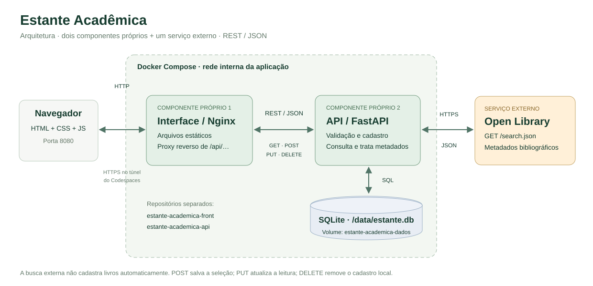

# estante-academica-front
Repositório para desenvolvimento do front-end do MVP da sprint "Arquitetura de Software", da pós-graduação PUC-Rio

<!-- ESTANTE ETAPA 4: INICIO -->

## Estante Acadêmica — aplicação web

Organizador de leituras com busca bibliográfica na Open Library. Permite escolher livros,
salvá-los no SQLite e acompanhar os estados **Quero ler**, **Lendo** e **Concluído**.
Projeto educacional do MVP de Arquitetura de Software; não é serviço de empréstimo,
leitor de e-books nem aplicação de produção com autenticação.

### Arquitetura



Dois componentes próprios, com repositórios e Dockerfiles separados:

- Interface: https://github.com/mgasilva/estante-academica-front
- API: https://github.com/mgasilva/estante-academica-api
- Serviço externo: Open Library, consultado somente pela API.

O JavaScript no navegador envia HTTP/JSON para caminhos relativos `/api/...`.
O Nginx entrega os arquivos estáticos e remove o prefixo `/api` ao encaminhar as chamadas
para `api:8000` na rede interna do Compose. A API executa as regras e acessa o SQLite
ou a Open Library. Assim, o navegador não depende do hostname específico do Codespace,
não precisa de token para a API e não faz chamadas entre portas/origens diferentes.
A autenticação da porta privada continua sendo responsabilidade do Codespaces.

### Requisitos

Docker Engine (ou Docker Desktop) funcionando, Docker Compose com suporte a `--wait`,
Git e internet para baixar as imagens e consultar o catálogo. Os componentes Python
executam dentro do Docker; não é necessário instalar suas dependências no computador.
Para os scripts auxiliares: Bash, Python 3.10+ e curl. No Windows, execute via WSL ou
terminal Linux do Codespaces. Node 20+ é opcional, apenas para testes unitários do JS.
Não é necessário instalar React, npm packages ou ferramentas de build da interface.

### Instalação do zero

Clone os repositórios como pastas irmãs:

```bash
git clone https://github.com/mgasilva/estante-academica-front.git
git clone https://github.com/mgasilva/estante-academica-api.git
cd estante-academica-front
bash scripts/subir_stack.sh
```

Estrutura esperada:

```text
projetos/
├── estante-academica-front/
└── estante-academica-api/
```

O script valida a configuração, constrói as imagens e inicializa os componentes.
A API criada isoladamente nas etapas anteriores é migrada depois da conferência do
volume e de uma cópia do SQLite para uma pasta irmã de backups. Nenhum banco é zerado.
Depois dessa migração, use o script do stack, não o script antigo de subir apenas a API.

Para um ambiente novo, a execução equivalente sem o script de migração é:

```bash
docker volume create estante-academica-dados
docker compose up -d --build --wait
```

O volume é declarado `external: true` para reutilizar exatamente o mesmo nome.
A rede dos serviços é criada pelo Compose. O Nginx resolve o nome `api` pelo DNS do Docker.
O Dockerfile da interface usa a tag oficial `nginx:stable-alpine`; essa tag pode receber
atualizações. O Dockerfile e as dependências Python pertencem ao repositório da API.

### Acesso e uso

- Interface local: http://127.0.0.1:8080
- Swagger local: http://127.0.0.1:8000/docs
- Codespaces: **Ports → 8080 → Open in Browser**, com visibilidade **Private**.
  Para Swagger, abra a porta 8000 e acrescente `/docs`.

Busque um título/autor/assunto no catálogo, selecione **Adicionar à estante**, volte à
estante e use **Editar** para atualizar o estado e as observações. **Remover** exige
confirmação. Também é possível cadastrar manualmente quando o serviço externo estiver
indisponível. Os filtros locais e a ordenação não escrevem no banco; o painel resume a
coleção inteira. Os registros não são armazenados em localStorage.

| Ação da interface | Método | Rota real da API |
|---|---|---|
| Carregar/atualizar a estante | GET | `/livros` |
| Buscar na Open Library | GET | `/catalogo` |
| Cadastrar manualmente/adicionar resultado | POST | `/livros` |
| Editar dados/estado/observações | PUT | `/livros/{livro_id}` |
| Remover com confirmação | DELETE | `/livros/{livro_id}` |

A seção **Por dentro da aplicação** mostra as últimas 12 requisições feitas pela aba:
método, caminho, código e duração. Não registra corpos dos livros nem credenciais.
É uma visualização didática, não um sistema de auditoria persistente.

### API externa: Open Library

Consulta utilizada pelo back-end:

```http
GET https://openlibrary.org/search.json?q=python&fields=key,title,author_name,first_publish_year&limit=6&page=1
```

Neste MVP, a consulta pública é feita sem cadastro, chave de API ou pagamento.
Somente metadados são consumidos, e não os arquivos/textos completos dos livros.
O back-end utiliza `key`, `title`, `author_name` e `first_publish_year`, normaliza os
resultados e retorna objetos compatíveis com o cadastro. O ano representa a primeira
publicação da **obra**, não necessariamente a edição do usuário.

A busca não grava automaticamente e não redireciona o usuário para outro site.
Resultados inválidos são descartados. A API local usa cache de cinco minutos, limite
de tamanho de resposta, timeout e chamadas espaçadas. Falhas externas retornam
mensagens controladas (502, 503 ou 504); a estante local continua independente.
O total de resultados informado pela Open Library pode incluir documentos descartados
pela normalização, por isso não é igual ao número de cartões exibidos.

O contato público no User-Agent é opcional. Para uso regular, defina o e-mail de contato
na variável `OPEN_LIBRARY_CONTACT` antes de iniciar o stack, ou em um `.env` local
(não versionado). Não use uma senha ou token nesse campo.

**Licenciamento dos dados:** a página de licenciamento informa que o Internet Archive
não reivindica novos direitos sobre o material da base, mas ressalva que contribuições
podem conter direitos preexistentes. Isso não é uma declaração de que todos os livros,
capas ou textos estão em domínio público. A interface identifica a fonte dos metadados.
Consulte as condições do serviço antes de outros usos:

- Busca: https://openlibrary.org/dev/docs/api/search
- Uso da API: https://openlibrary.org/developers/api
- Licenciamento: https://openlibrary.org/developers/licensing

### Testes

```bash
# Arquivos estáticos e proxy (sem escrita no banco):
python scripts/testar_front.py

# Os 12 testes de cadastro pela porta da interface/proxy:
python ../estante-academica-api/scripts/testar_api.py --base-url http://127.0.0.1:8080/api

# 20 testes das funções JavaScript (Node, sem npm install):
node --test tests/modelo.test.mjs
```

Os testes de cadastro criam e removem apenas seus próprios registros temporários.
Os testes unitários de JS não substituem o teste real do navegador, Docker e Open Library.
O checklist manual está em [docs/etapa4.md](docs/etapa4.md).

### Operação, persistência e diagnóstico

```bash
# Na raiz do front-end:
docker compose ps
docker compose logs --tail=60 api front

# Reconstruir após alterar os fontes de qualquer um dos repositórios:
bash scripts/subir_stack.sh

# Parar os serviços sem excluir dados:
docker compose stop

# Retomar:
docker compose up -d --wait
```

Banco: `/data/estante.db` no volume `estante-academica-dados`. O volume sobrevive à
substituição dos contêineres, mas não é backup externo nem proteção contra exclusão
ou reconstrução do Codespace. Não remova o volume. Os arquivos do SQLite não devem
ser versionados. Após o primeiro uso, edite um livro, reconstrua o stack e consulte
novamente para comprovar a persistência.

Não exponha esta aplicação publicamente: não há login, controle de acesso por usuário
ou proteção completa para produção. Mantenha as portas privadas no Codespaces.
Não abra o HTML com Live Server: isso remove o proxy e impede as chamadas `/api`.
Os servidores dentro dos contêineres usam HTTP; o túnel do Codespaces fornece o acesso
HTTPS ao navegador. Os detalhes estão em [docs/etapa4.md](docs/etapa4.md).

<!-- ESTANTE ETAPA 4: FIM -->
